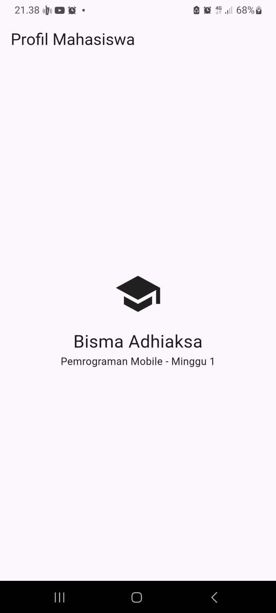

# Tujuan
tujuan dari praktikum ini adalah pengenalan tentang bahasa dart, framework flutter

# Fitur Utama
fitur utama dari praktikum ini adalah profil mahasiswa yang menampilkan nama

# Tech Stack
stack teknologi yang dipakai flutter

# Cara Menjalankan
cara menjalankannya tergantung pada tujuan, jika tujuannya melakukan debug, lebih mudah menggunakan run debug karena adanya hot reload. jika tujuannya testing lebih baik langsung run flutternya

# Hasil
hasil yang ingin dicapai adalah tampilan yang menampilkan nama mahasiswa dan nama praktikumnya

# Screenshot
Latihan madiri persegi panjang

Lathihan profil mahasiswa

Kode Praktikum

Hasil Akhir praktikum

