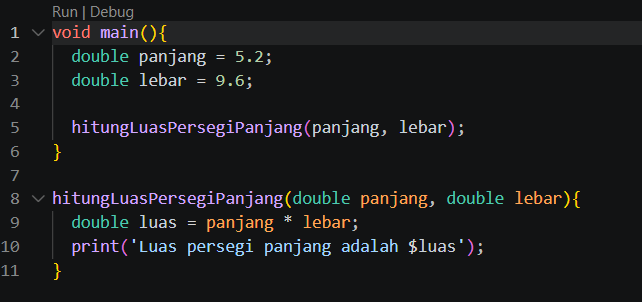
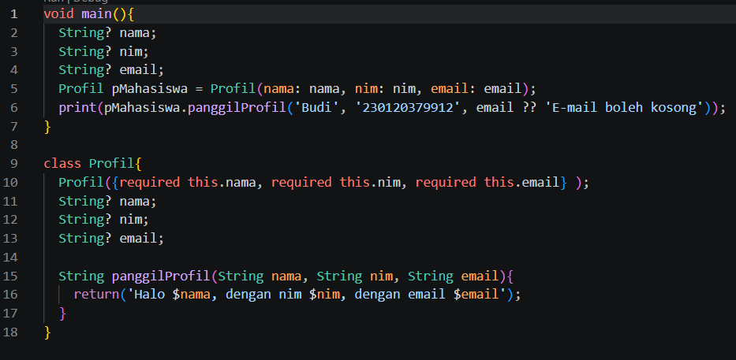
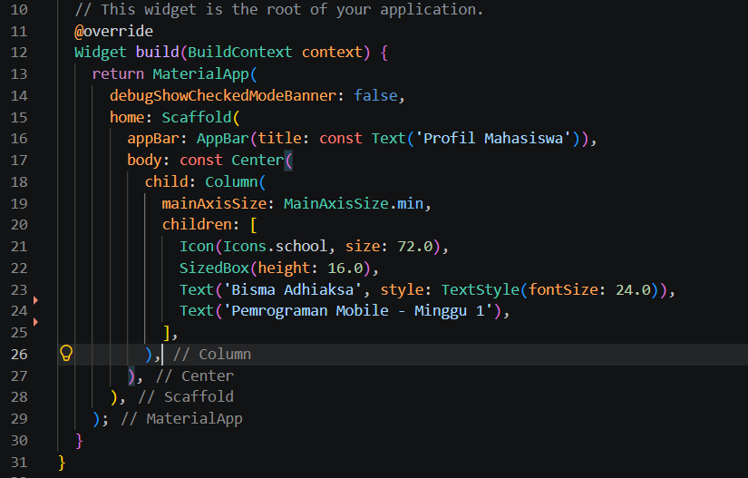
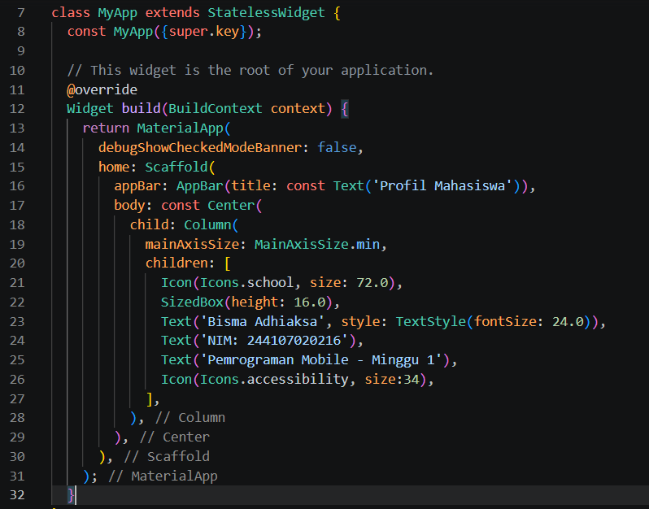
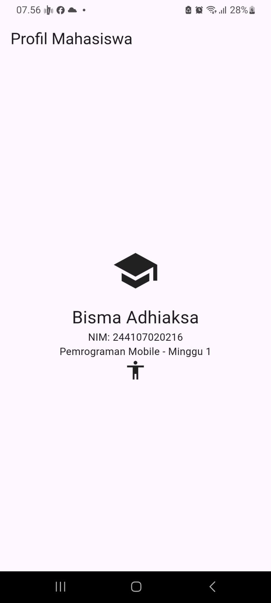

# Tujuan
- menjelaskan evolusi pengembangan mobile serta perbedaan native, hybrid, dan cross-platform;
- menjelaskan arsitektur Flutter, peran Dart, struktur proyek, dan widget tree;
- mengulang dasar Dart: variabel, tipe data, fungsi, class, dan null safety;
- menyiapkan Flutter, Android SDK, emulator atau perangkat fisik, lalu menjalankan aplikasi pertama;
- mengubah UI awal Flutter dan menyimpan hasilnya pada repository Git pribadi.

# Fitur Utama
Fitur utama dari Flutter adalah **framework** (widget dan API), **engine** (rendering, teks, grafis), serta **embedder** yang menghubungkan aplikasi dengan Android, iOS, web, atau desktop. Dart mendukung **just-in-time** (JIT) saat pengembangan dan ahead-of-time (AOT) saat build rilis.

- Hot reload memasukkan perubahan kode tanpa biasanya menghapus state; gunakan untuk iterasi UI.
- Hot restart menjalankan ulang aplikasi dari awal sehingga state hilang; gunakan ketika perubahan tidak dapat diterapkan melalui hot reload, misalnya inisialisasi aplikasi.

# Tech Stack
- Flutter

# Cara Menjalankan
cara menjalankannya tergantung pada tujuan, jika tujuannya melakukan debug, lebih mudah menggunakan run debug karena adanya hot reload. jika tujuannya testing lebih baik langsung run flutternya

# Hasil
- Mengetahui Ekosistem mobile dan Flutter
- Mengetahui dasar Dart dan dasar dari framework Flutter
- Mengetahui cara Null Handling 
- Menyiapkan environment untuk git dan FLutter
- Mampu mengubah UI Default di Flutter
- Mampu menyiapkan repository untuk pertemuan 16 minggu
- Mampu mengerjakan mini assignment

# Refleksi
- native lebih cocok digunakan ketika memilki kebutuhan khusus untuk menghubungkan aplikasi dengan sistem operasi langsung, misal membutuhkan akses BLE

- Perubahan state berhubungan dengan widget tree dan UI deklaratif, dengan berubahnya state, maka susunan widget tree juga bisa berubah(terbentuk baru), dengan demikian UI deklaratifnya juga berubah

- commit kecil dengan pesan jelas bermanfaat bagi tim untuk memantau update yang diberikan anggota sehingga bisa melanjutkan pekerjaan yang ada, sedangkan untuk portofolio membantu untuk memperlihatkan kontribusi terhadap projek

# Screenshot
Latihan madiri persegi panjang

Lathihan profil mahasiswa

Kode Praktikum

Hasil Akhir praktikum

Kode Mini Assignment

Hasil Mini Assignment

