# Tujuan
- Menjelaskan prinsip declarative UI dan hubungan antara widget, konfigurasi, serta state.
- Menggunakan StatelessWidget, StatefulWidget, Container, Row, Column, dan Expanded.
- Membedakan komponen Material 3 dan Cupertino untuk kebutuhan platform yang berbeda.
- Membangun layout responsif untuk ukuran layar mobile dan tablet.
- Menerapkan theme, dark mode, styling, dan aksesibilitas dasar.

# Fitur Utama
- row
- column
- MaterialApp
- Responsive Layout
- Theme

# Tech Stack
- Flutter

# Cara Menjalankan

# Hasil
- Dapat menjelaskan prinsip Declarative UI dan hubungan antara widget, konfigurasim serta state
- Bisa menggunakan StatelessWidget, StatefulWidget, COntainer, Row, Column, dan Expanded
- Bisa membedakan komponen material3 dan Cupertino
- Bisa membangun layout responsive
- Bisa menerapkan dark mode, styling, dan aksesibilitas dasar

# Refleksi
- native lebih cocok digunakan ketika memilki kebutuhan khusus untuk menghubungkan aplikasi dengan sistem operasi langsung, misal membutuhkan akses BLE

- Perubahan state berhubungan dengan widget tree dan UI deklaratif, dengan berubahnya state, maka susunan widget tree juga bisa berubah(terbentuk baru), dengan demikian UI deklaratifnya juga berubah

- commit kecil dengan pesan jelas bermanfaat bagi tim untuk memantau update yang diberikan anggota sehingga bisa melanjutkan pekerjaan yang ada, sedangkan untuk portofolio membantu untuk memperlihatkan kontribusi terhadap projek

# Screenshot
Kode Warm Up 
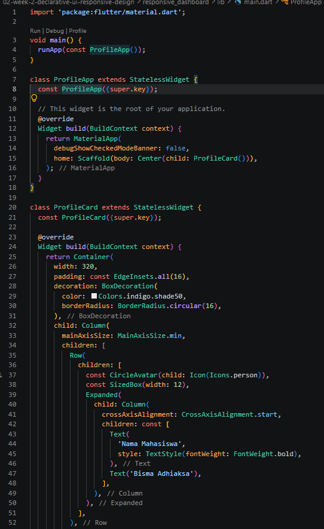

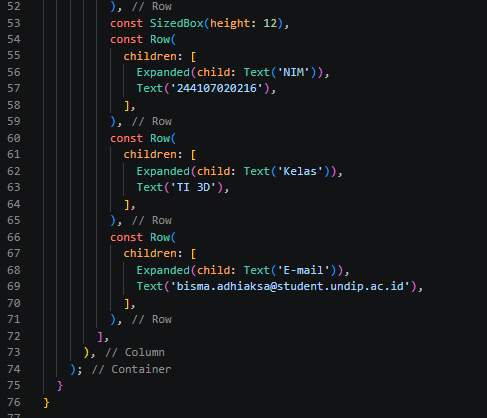

Hasil Warm Up
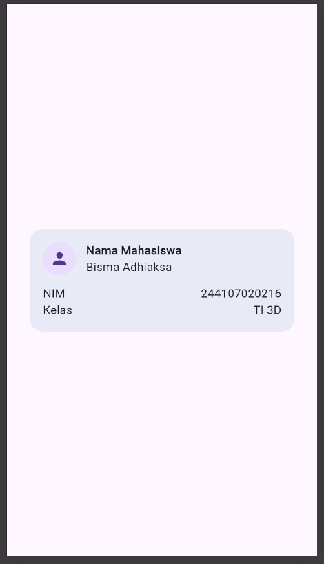

## Eksperimen Warm Up
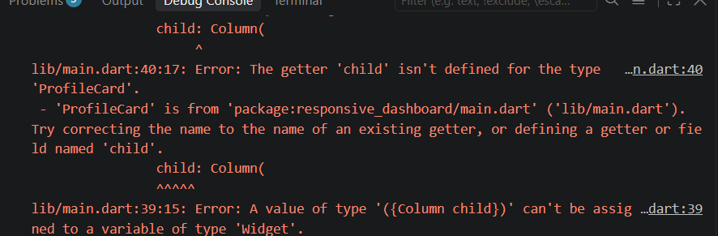
tidak bisa dijalankan dan tidak ada peringatan overflow

Ganti mainAxisSize
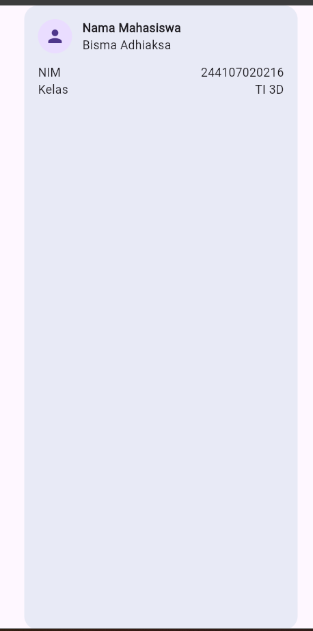

Kode penambahan baris baru
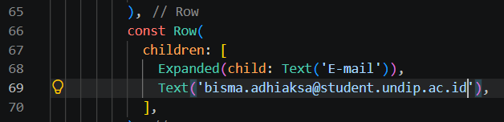
Hasil penambahan baris baru
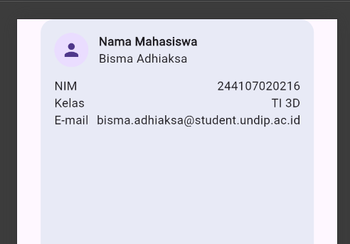

## Praktikum: dashboard responsif

Kode Dashboard Responsive
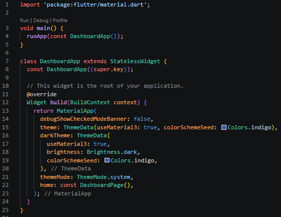
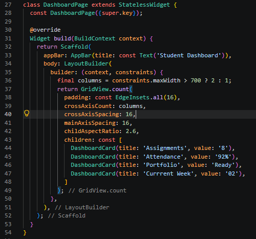
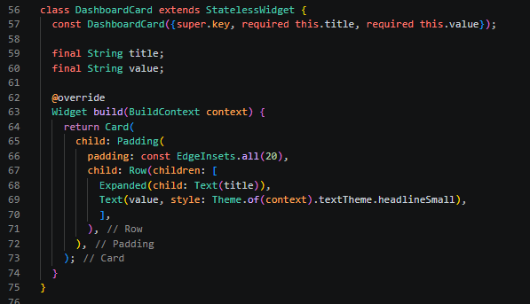

Hasil Kode
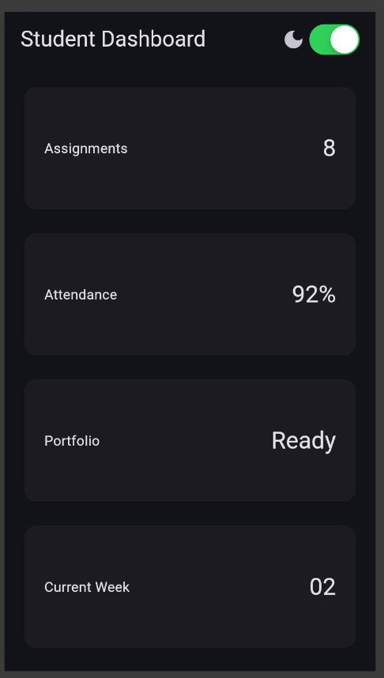

ubah breakpoint
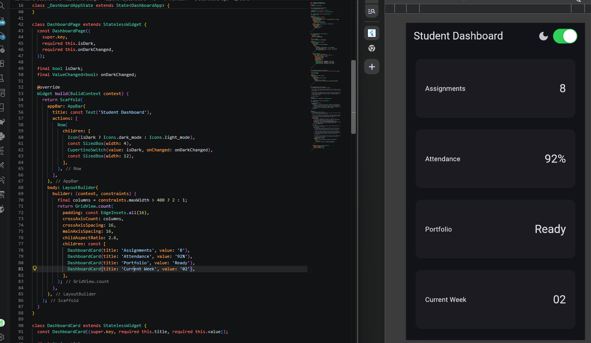
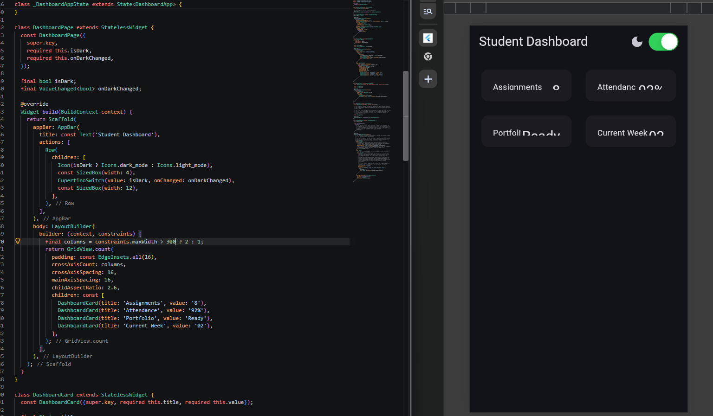
tidak ada perubahan di perubahan angka break point, hanya berubah di angka antara 300 - 400

Ukuran layar berbeda
Samsung S8+ Ultra
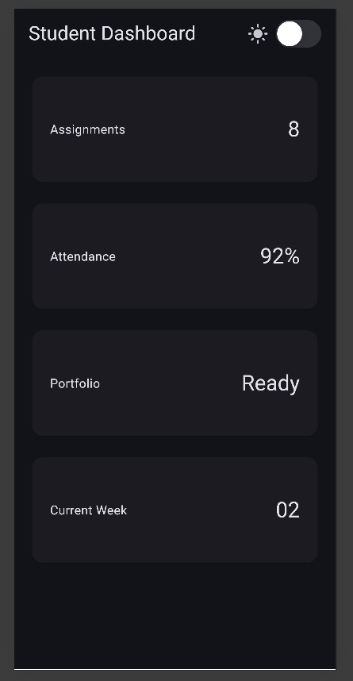
Samsung Z Fold
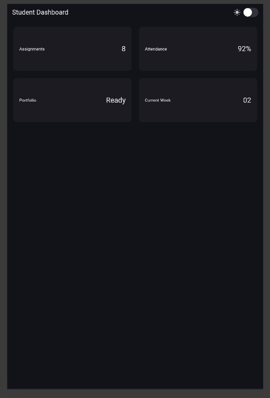

Semantics
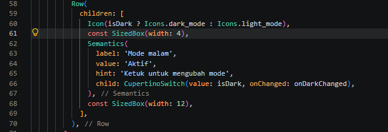

