# Tujuan
- Menjelaskan prinsip declarative UI dan hubungan antara widget, konfigurasi, serta state.
- Menggunakan StatelessWidget, StatefulWidget, Container, Row, Column, dan Expanded.
- Membedakan komponen Material 3 dan Cupertino untuk kebutuhan platform yang berbeda.
- Membangun layout responsif untuk ukuran layar mobile dan tablet.
- Menerapkan theme, dark mode, styling, dan aksesibilitas dasar.

# Fitur Utama
- row
- column
- MaterialApp
- Responsive Layout
- Theme

# Tech Stack
- Flutter

# Cara Menjalankan

1. Pastikan Flutter sudah terinstall.
2. Clone repository ini.
3. Masuk ke folder project.
`cd nama-project`
4. Jalankan perintah berikut untuk mengambil dependency:
`flutter pub get`
5. Jalankan aplikasi:
`flutter run`

# Hasil
- Dapat menjelaskan prinsip Declarative UI dan hubungan antara widget, konfigurasim serta state
- Bisa menggunakan StatelessWidget, StatefulWidget, COntainer, Row, Column, dan Expanded
- Bisa membedakan komponen material3 dan Cupertino
- Bisa membangun layout responsive
- Bisa menerapkan dark mode, styling, dan aksesibilitas dasar

# Refleksi
- imperative lebih berfokus pada langkah atau proses bagaimana UI diubah, sedangkan declarative lebih berfokus pada seperti apa UI yang diinginkan berdasarkan kondisi atau state yang ada

- `Expanded` membantu ketika ingin membagi ruang yang tersedia pada `Row` atau `Column` secara fleksibel, tetapi bisa menghasilkan layout error ketika digunakan pada parent yang tidak memiliki batas ukuran yang jelas atau constraint yang sesuai

- breakpoint memengaruhi bagaimana layout menyesuaikan ukuran layar, misalnya pada layar kecil menggunakan satu kolom dan pada layar lebih besar menggunakan dua kolom, sedangkan theme memengaruhi tampilan seperti warna dan dark mode sehingga tampilan dapat menyesuaikan kebutuhan dan kondisi pengguna

- rekomendasi dari AI perlu diverifikasi dengan mencoba menjalankan kode dan melihat hasilnya secara langsung, terutama memastikan tidak terjadi error atau overflow, serta memastikan hasilnya sesuai dengan kebutuhan dan memahami kode yang diberikan sebelum digunakan

# Screenshot
Kode Warm Up 

Hasil Warm Up

## Eksperimen Warm Up

tidak bisa dijalankan dan tidak ada peringatan overflow

Ganti mainAxisSize

Kode penambahan baris baru

Hasil penambahan baris baru

## Praktikum: dashboard responsif

Kode Dashboard Responsive

Hasil Kode

ubah breakpoint

tidak ada perubahan di perubahan angka break point, hanya berubah di angka antara 300 - 400

Ukuran layar berbeda

Samsung S8+ Ultra

Samsung Z Fold

Semantics

# Tugas dan AI design exploration

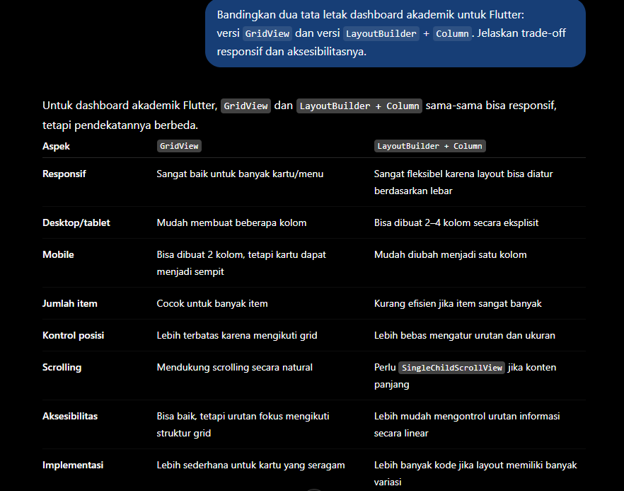
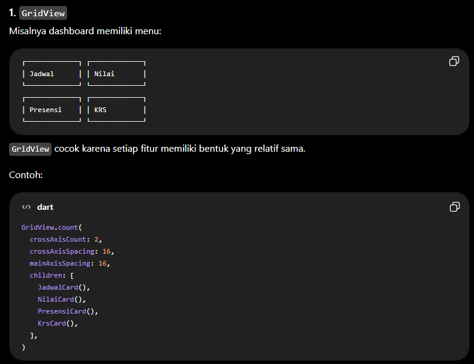
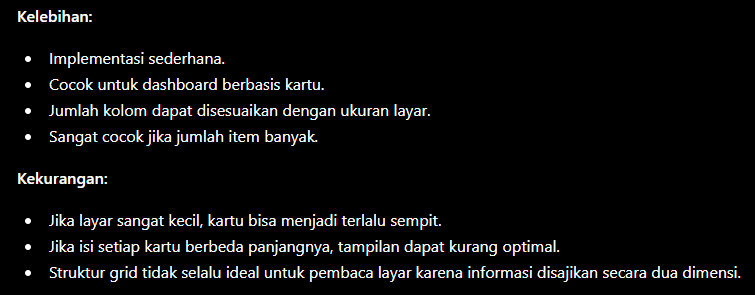
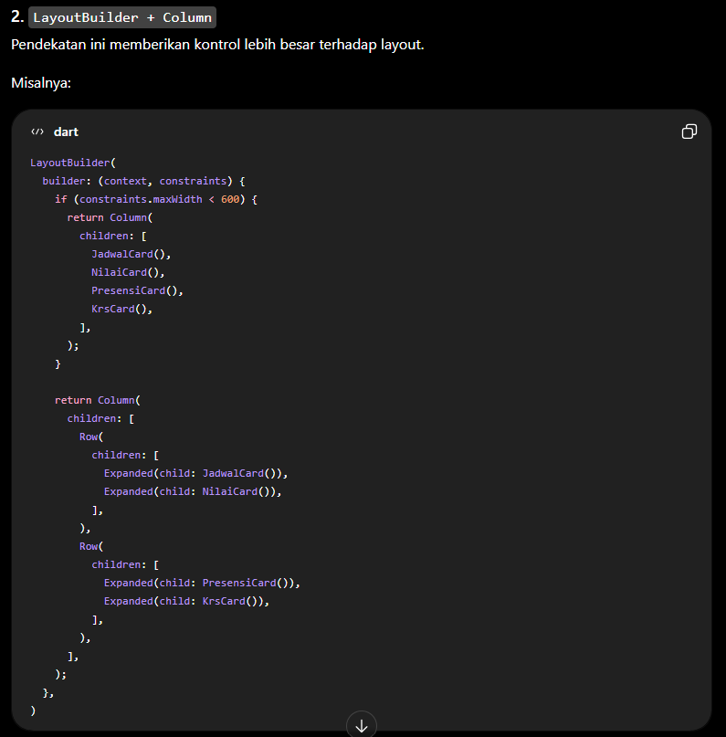
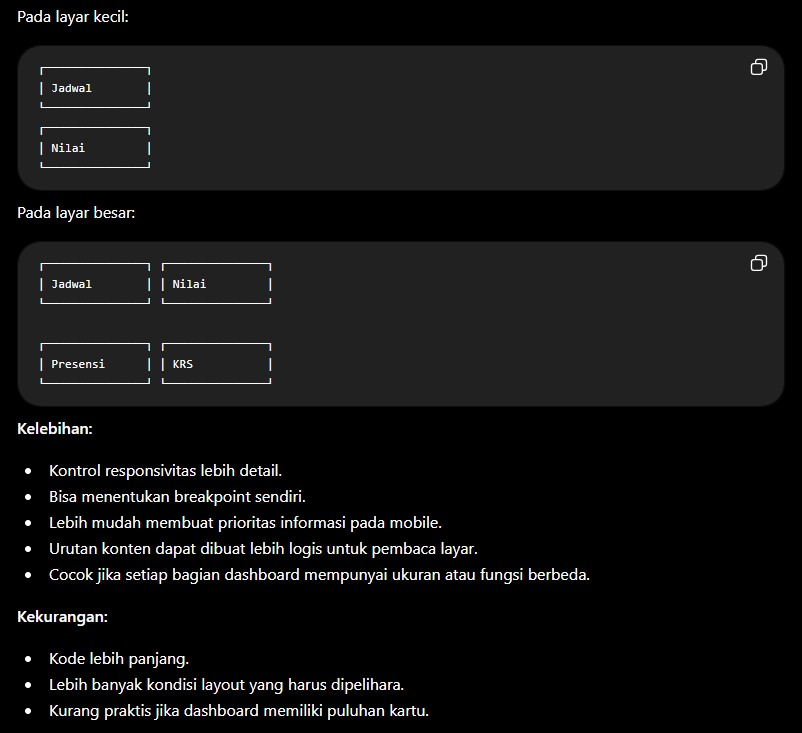
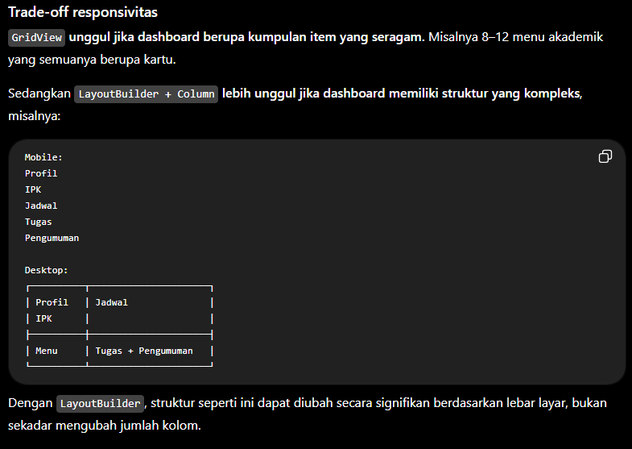
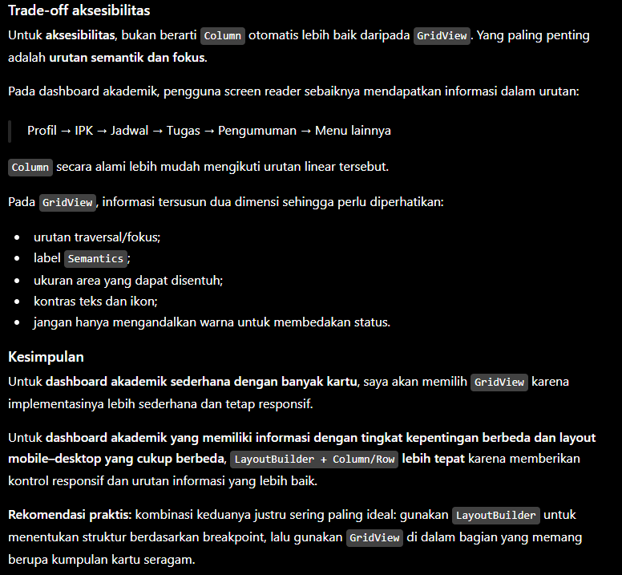

# Kode AI

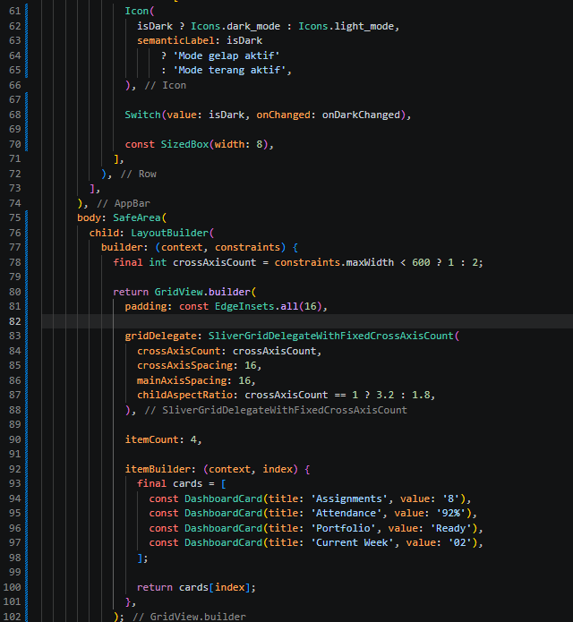
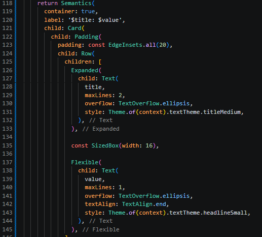

Hasil kode AI
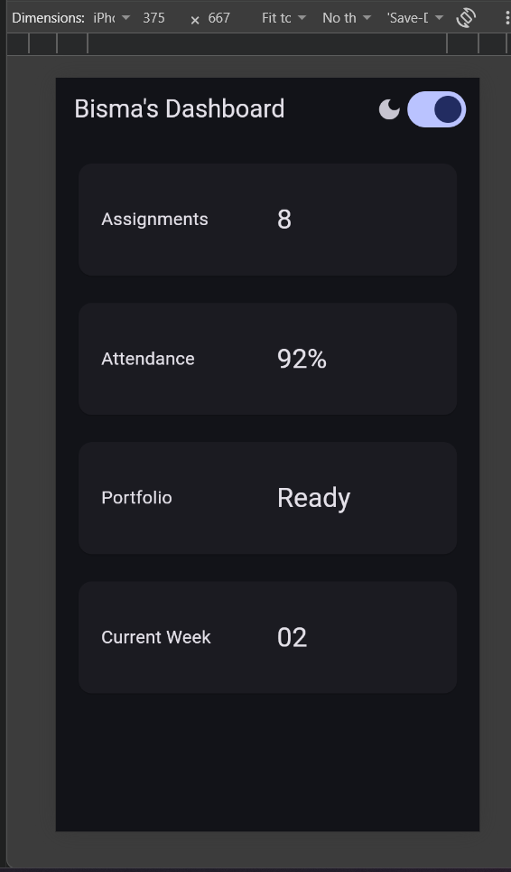

kalau diihat dari hasilnya tampilan menjadi lebih responsive, lalu tidak butuh 2 import package

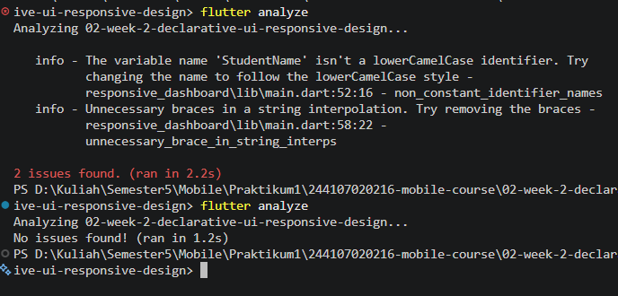

# Testing dasar

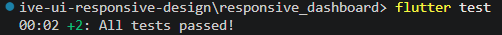
