# Tujuan
- menjelaskan konsep navigasi, route, dan perbedaan Navigator 1.0 dengan GoRouter;
- menerapkan navigasi multi-page dengan GoRouter, termasuk passing argument dan deep link sederhana;
- menjelaskan mengapa state management diperlukan dan cara kerja Riverpod (Provider, ConsumerWidget, Notifier);
- menggunakan AsyncValue untuk menangani state loading, error, dan success pada UI;
- membangun aplikasi ToDo dengan navigasi dan Riverpod, lalu memverifikasi hasilnya dengan widget test sederhana.

# Fitur Utama
### Navigation
mekanisme pindah layar. di flutter tiap layar adalah route yang ditumpuk di `Navigator`(stack). cara lama menggunakan `Navigator.push` dan `Navigator.pop` 

GoRouter adalah router deklaratif dengan konsep:

|Konsep         |Penjelasan                                         |
|---------------|---------------------------------------------------|
|GoRoute        |	Definisi path dan widget tujuan, misal /, /detail/:id.|
|context.go()   |	Pindah route (mengganti stack, cocok untuk redirect login).|
|context.push() |	Tumpuk route baru di atas stack (cocok untuk detail).|
|path parameter |	Nilai dinamis pada path, diakses lewat state.pathParameters.|
|extra          |	Mengirim objek antar route (gunakan hati-hati, tidak tersimpan saat proses restart web).|
|redirect       |	Guard navigasi terpusat, misal cek status login.|

### State Management dengan Riverpod
`setState` cukup untuk state lokal satu widget. Namun ketika state harus dibagi antar banyak halaman (misal daftar ToDo yang ditampilkan di Home dan diubah di halaman lain), memindahkan state ke atas widget tree membuat kode rumit (prop drilling). State management memindahkan state keluar dari widget sehingga:

UI dapat dibangun ulang dari state yang sama secara konsisten (UI deklaratif = f(state));
logika bisa diuji tanpa membangun UI;
state tetap hidup meski widget sudah tidak tampil.
Pada mata kuliah ini kita menggunakan Riverpod berbasis `Provider` yang bersifat compile-safe, tidak bergantung pada `BuildContext`, dan mudah diuji.

Konsep inti Riverpod:

|Konsep     |Penjelasan                                             |
|-----------|-------------------------------------------------------|
|ProviderScope|	Wadah global yang menyimpan semua provider, membungkus root aplikasi.|
|Provider|	Nilai read-only/immutable (misal konfigurasi, service).|
|Notifier + NotifierProvider|	State yang bisa berubah melalui method; UI memanggil method, bukan mengubah state langsung.|
|ConsumerWidget|	Widget yang bisa membaca provider lewat ref.|
|ref.watch vs ref.read| watch: build ulang saat state berubah (di dalam build). read: sekali baca (di callback/event).|

### AsyncValue: loading, error, success
Masalah state asinkron
Banyak state berasal dari proses asinkron (membaca database, memanggil API). UI harus menampilkan tiga kemungkinan: loading (proses berjalan), error (gagal), dan success (data siap). Mengelola tiga flag boolean secara manual rawan kesalahan (`isLoading` dan `hasError` bisa tidak konsisten).

AsyncValue
Riverpod menyediakan `AsyncValue<T>` yang memodelkan ketiga kondisi tersebut dalam satu tipe. Gunakan `AsyncNotifier` untuk state asinkron:

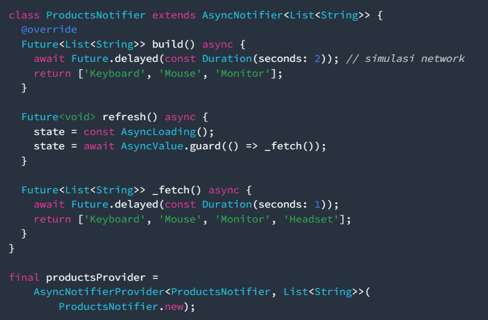

Di sisi UI, `AsyncValue` dapat dipola dengan `when` atau `if-case` matching:

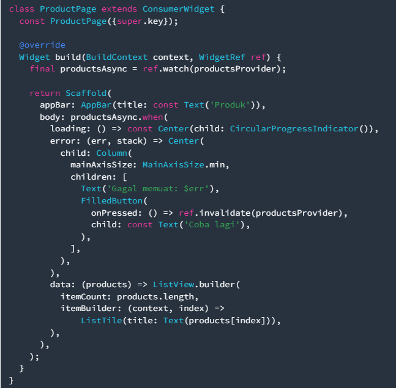

# Tech Stack
- Flutter
- Dart

# Cara Menjalankan
cara menjalankannya tergantung pada tujuan, jika tujuannya melakukan debug, lebih mudah menggunakan run debug karena adanya hot reload. jika tujuannya testing lebih baik langsung run flutternya

# Hasil
- Mengetahui Ekosistem mobile dan Flutter
- Mengetahui dasar Dart dan dasar dari framework Flutter
- Mengetahui cara Null Handling 
- Menyiapkan environment untuk git dan FLutter
- Mampu mengubah UI Default di Flutter
- Mampu menyiapkan repository untuk pertemuan 16 minggu
- Mampu mengerjakan mini assignment

# Refleksi
- native lebih cocok digunakan ketika memilki kebutuhan khusus untuk menghubungkan aplikasi dengan sistem operasi langsung, misal membutuhkan akses BLE

- Perubahan state berhubungan dengan widget tree dan UI deklaratif, dengan berubahnya state, maka susunan widget tree juga bisa berubah(terbentuk baru), dengan demikian UI deklaratifnya juga berubah

- commit kecil dengan pesan jelas bermanfaat bagi tim untuk memantau update yang diberikan anggota sehingga bisa melanjutkan pekerjaan yang ada, sedangkan untuk portofolio membantu untuk memperlihatkan kontribusi terhadap projek

# AI Challenge

## Prompt yang Digunakan
    Buatkan halaman Flutter bernama StatsPage menggunakan flutter_riverpod.
    Requirements:
    - ConsumerWidget dengan satu AsyncNotifierProvider yang mensimulasikan
      pengambilan data statistik (delay 2 detik, kadang gagal 30%).
    - UI harus menangani loading (spinner), error (pesan + tombol retry),
      dan success (ListView 3 item).
    - Berikan unit test untuk notifier-nya.
    Jelaskan setiap bagian kode dalam komentar.

## Hasil dan Penjelasan Kode
Kode ditempatkan pada project `week3_todo`:

- `lib/providers/stats_provider.dart` berisi model `Stat`, `StatsNotifier` (turunan `AsyncNotifier<List<Stat>>`), dan `statsProvider` (`AsyncNotifierProvider`).
  - `build()` dipanggil otomatis Riverpod dan hasilnya dibungkus `AsyncValue` (loading -> data/error).
  - `_fetch()` mensimulasikan pengambilan data: `await Future.delayed(delay)` lalu gagal dengan peluang `failureRate` (default 0.3).
  - `delay` dan `failureRate` dibuat sebagai parameter supaya unit test bisa deterministik (tidak bergantung pada random).
  - `refresh()` memakai `AsyncValue.guard` agar exception otomatis jadi `AsyncError`, tanpa `try/catch` manual.

- `lib/pages/stats_page.dart` berisi `StatsPage` (`ConsumerWidget`) yang memakai `ref.watch(statsProvider)` dan `statsAsync.when(...)` untuk menangani loading (spinner), error (pesan + tombol "Coba lagi" yang memanggil `ref.invalidate`), dan success (ListView 3 item).

- `test/stats_provider_test.dart` berisi 3 unit test: berhasil mengembalikan 3 item, menghasilkan error saat gagal, dan refresh menjalankan ulang provider. Test memakai `ProviderContainer` dengan `overrideWith` agar `failureRate` bisa dipaksa 0 (selalu berhasil) atau 1 (selalu gagal).

## AI Verification Checklist
- [x] State diubah secara immutable — `build()` mengembalikan list baru, tidak ada `state.add()` atau mutasi list langsung.
- [x] `ref.watch` hanya di dalam `build`, `ref.read` hanya di callback — `stats_page.dart` memakai `ref.watch` di `build` dan `ref.invalidate` di `onPressed`.
- [x] Ketiga state `AsyncValue` ditangani — `when(loading:, error:, data:)` semuanya lengkap, bukan hanya success.
- [x] Provider dideklarasikan dengan tipe eksplisit (`AsyncNotifierProvider<StatsNotifier, List<Stat>>`) dan tidak duplikat dengan provider lain.
- [x] Tidak memakai API Riverpod lama — sudah memakai `AsyncNotifier` + `ConsumerWidget`, bukan `StateProvider`/`StateNotifierProvider`.
- [x] `flutter analyze` tanpa issue dan `flutter test` lulus (3 test passed).

## Screenshot AI Challenge

Kode Provider (StatsNotifier)
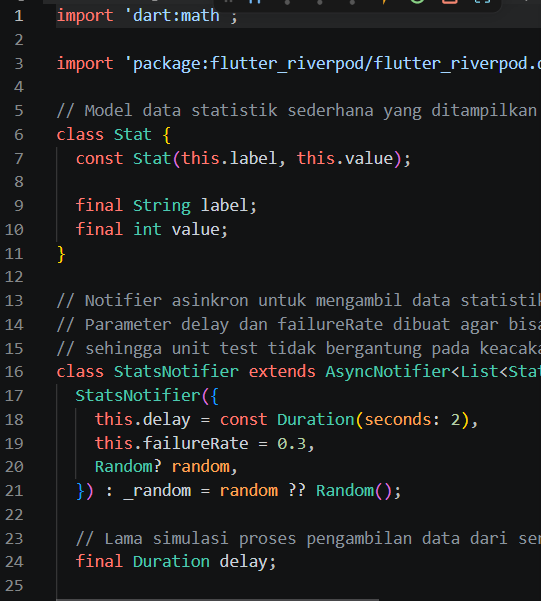

Kode Halaman (StatsPage)
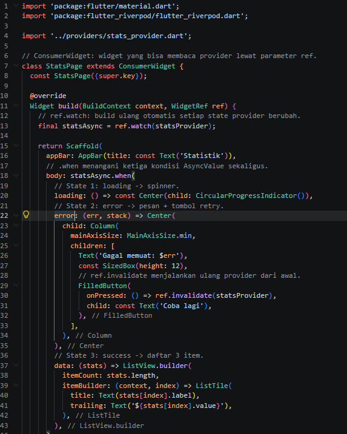

Unit Test Lulus
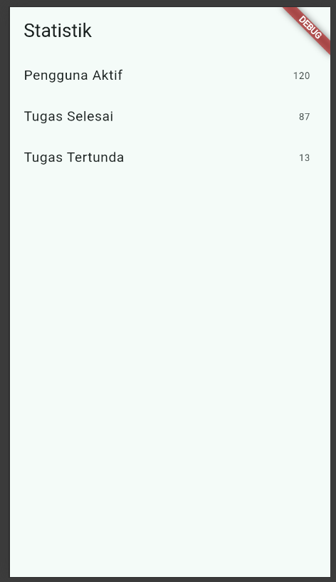

## Refleksi AI Challenge
Hasil AI sudah saya verifikasi dengan membaca tiap baris, menjalankan `flutter analyze` dan `flutter test`. Bagian yang saya sesuaikan adalah menambahkan parameter `delay` dan `failureRate` pada `StatsNotifier`, karena desain awal dengan `Random` langsung membuat unit test tidak dapat diprediksi (flaky). Dengan parameter tersebut test menjadi deterministik dan tetap memenuhi syarat "kadang gagal 30%" pada aplikasi (default `failureRate = 0.3`).

# Screenshot
## Praktikum 1

add go_router
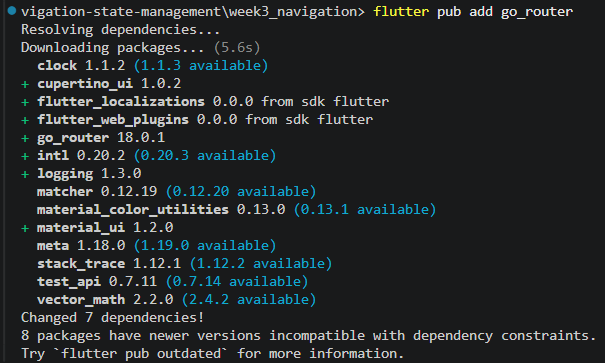

kode main
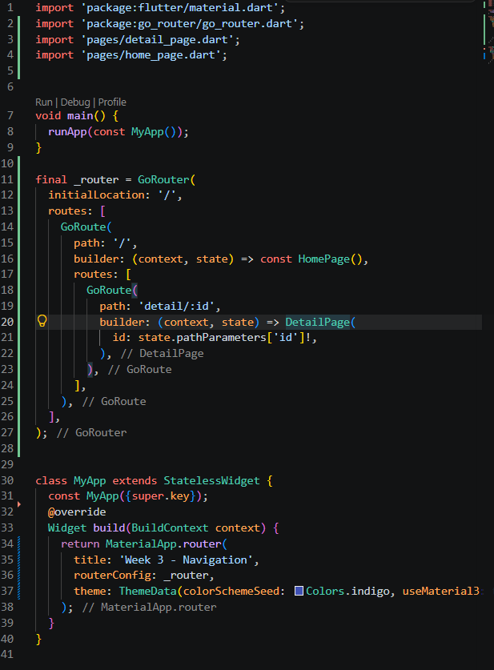

kode home_page
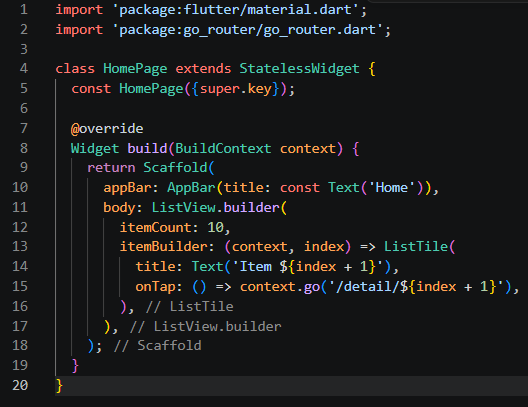

kode detail_page
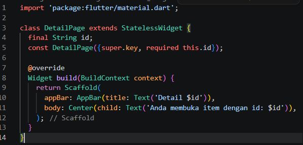

hasil kode
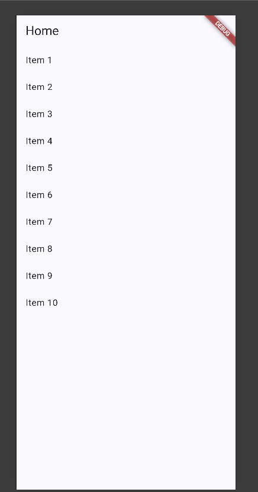

## Praktikum 2

Kode Main
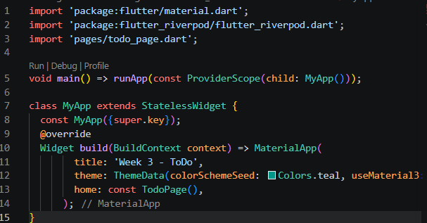

Kode Providers
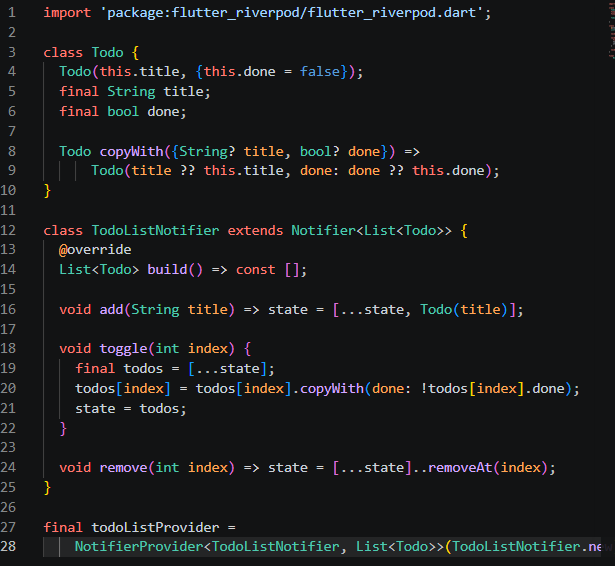

Kode Pages
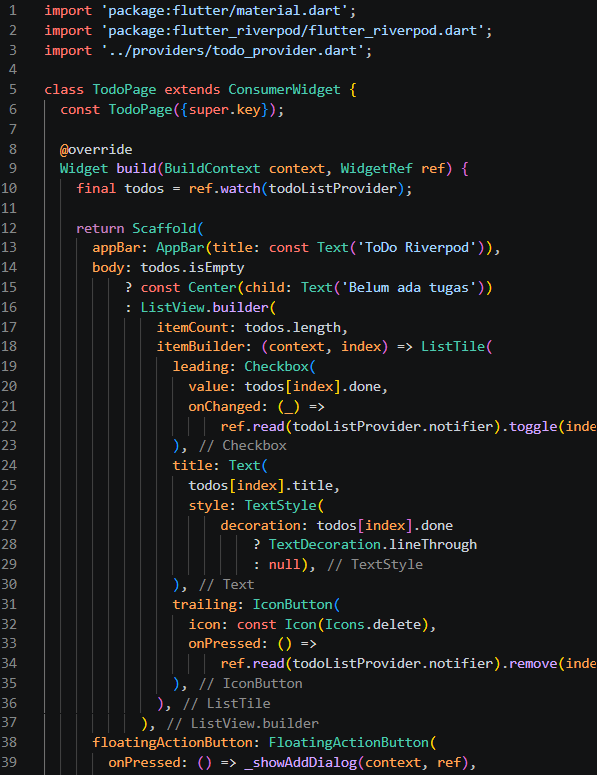

Hasil Kode
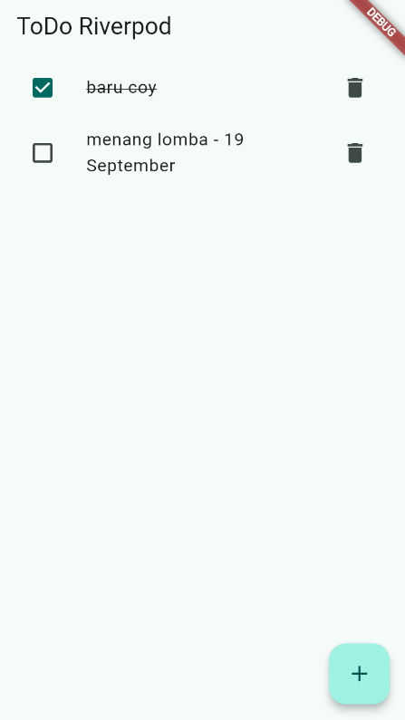

## Praktikum 3

Kode AsyncValue

Kode Pola Async

Hasil
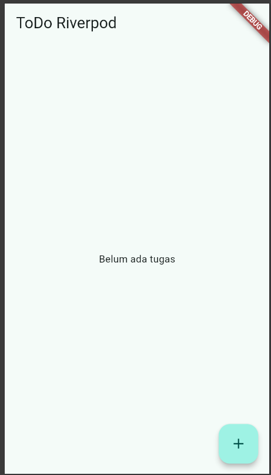

Throw Exception
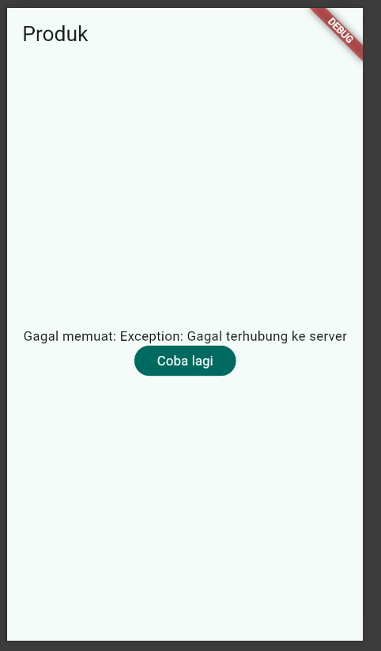

    Mengapa menampilkan ulang data lama (stale data) dengan indikator refresh kadang lebih baik daripada mengosongkan layar? Kapan pola itu penting?

1. Mencegah layar kosong/berkedip — mengosongkan layar membuat UI "melompat" (loading spinner menggantikan konten), yang terasa lebih lambat dan mengganggu.
2. Menjaga konteks pengguna — pengguna masih bisa melihat data sebelumnya saat menunggu update, alih-alih kehilangan informasi.
3. Kontinuitas persepsi — persepsi "cepat" lebih terjaga; pengguna melihat progress tanpa kehilangan isi layar.
Kapan pola ini penting:
- Pada refresh/pull-to-refresh data yang sudah pernah tampil (mis. daftar tugas, feed, dashboard statistik) — data lama tetap relevan sementara data baru dimuat.
- Saat koneksi lambat/tidak stabil — lebih baik tampilkan data terakhir daripada error/kosong.
- Pada aplikasi offline-first — tampilkan cache lokal dulu, lalu sinkronkan.
    Sebaliknya, mengosongkan layar (full loading) lebih tepat saat memuat pertama kali (belum ada data) atau saat data lama sudah tidak valid/berbeda konteks (mis. pindah akun/user), sehingga menampilkan data lama justru menyesatkan.
    
    Riverpod mendukung ini lewat AsyncValue yang menyimpan nilai sebelumnya — misalnya productsAsync.isRefreshing / asyncValue.valueOrNull untuk tetap menampilkan data lama sambil memuat.