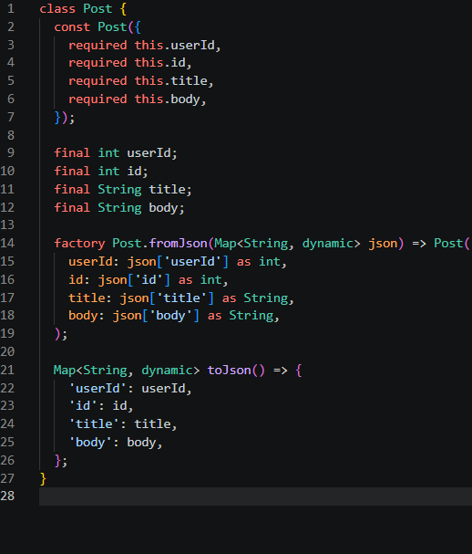
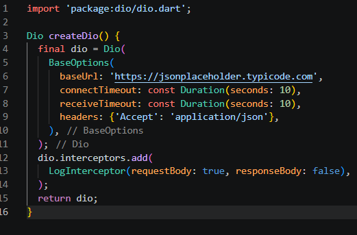
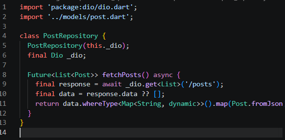
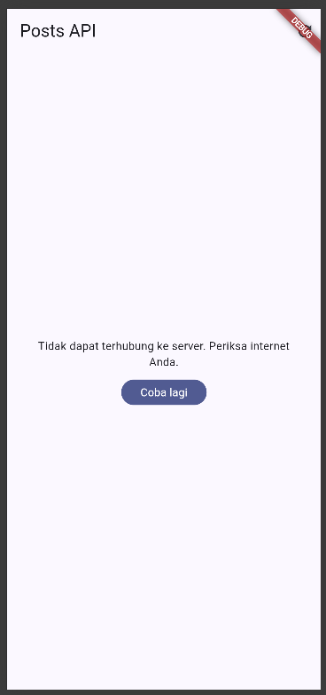
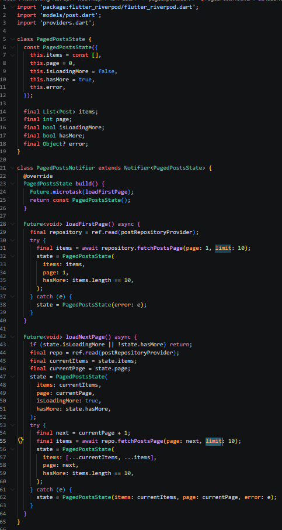
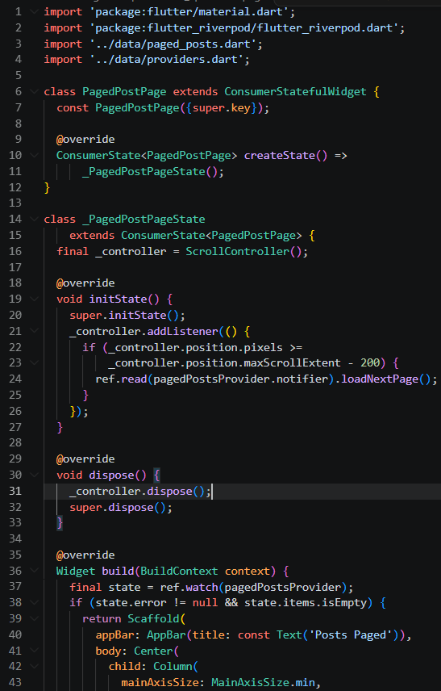
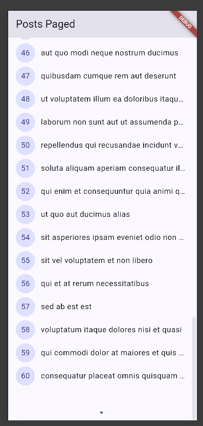

# Tujuan
- menjelaskan konsep HTTP, REST API, dan JSON;
- memetakan JSON ke model Dart (serialization) dengan aman null;
- menerapkan repository pattern dasar sehingga UI tidak memanggil API secara langsung;
- mengonfigurasi Dio (base URL, timeout, interceptor) dan menangani error jaringan;
- menampilkan state loading, error, empty, dan success pada UI dengan AsyncValue + Riverpod;
- menerapkan pagination dasar (infinite scroll).


# Fitur Utama
### HTTP dan REST API
HTTP adalah protokol request–response: client mengirim request (method + URL + header + body), server membalas dengan status code + body. REST memetakan operasi ke resource melalui URL dan method HTTP.

|Method     |Makna pada koleksi resource                 |Contoh             |
|-----------|--------------------------------------------|-------------------|
|`GET`      |Membaca data (tanpa efek samping).          |`GET /posts`, `GET /posts/1`|
|`POST`     |Membuat resource baru.                      |`POST /posts`|
|`PUT`/`PATCH`|Mengganti / memperbarui sebagian resource.|`PUT /posts/1`|
|`DELETE`   |Menghapus resource.                         |`DELETE /posts/1`|

Status code penting: `200 OK`, `201 Created`, `400 Bad Request`, `401 Unauthorized`, `404 Not Found`, `500 Internal Server Error`. Aplikasi mobile wajib menyiapkan UI untuk tiap kelompok: success (2xx), client error (4xx), dan server/network error (5xx/timeout).

API dummy yang dipakai minggu ini adalah [JSONPlaceholder](https://jsonplaceholder.typicode.com) (gratis, tanpa API key) dengan endpoint `GET /posts`.

### JSON dan model Dart
JSON adalah format tukar data standar API. Di Dart, JSON mentah (`Map<String, dynamic>`) harus dipetakan ke class model agar aman terhadap null dan kesalahan ketik. Pola manual `fromJson`/`toJson` cukup untuk codelab ini; untuk project besar gunakan code generator (`json_serializable` / `freezed`).

Cast defensif seperti `as String? ?? ''` dan `(json['id'] as num?)?.toInt() ?? 0` mencegah crash `type 'Null' is not a subtype` yang menjadi sumber bug paling umum pada integrasi API pertama.

### Repository pattern dasar
Aturan arsitektur minggu ini (jembatan menuju Clean Architecture di Minggu 7):

- **UI tidak boleh memanggil Dio/http secara langsung.** UI hanya membaca provider.
- **Repository** adalah satu-satunya pintu ke sumber data (API). Ia mengubah exception jaringan menjadi kegagalan yang bermakna bagi UI.
- **Provider Riverpod** mengekspos `AsyncValue` ke UI (loading/error/data).

```
UI (ConsumerWidget) --watch--> Provider (AsyncValue)
Provider --panggil--> Repository --pakai--> Dio --HTTP--> REST API
```

### Dio terpusat
Seluruh konfigurasi jaringan (base URL, timeout, logging) hidup di satu tempat (`api_client.dart`). Dio dipilih karena memberi timeout per-request, interceptor (logging/auth header), dan error terstruktur (`DioException` dengan `type`) tanpa boilerplate tambahan.

### AsyncValue: loading, error, empty, success
UI menangani empat state: loading (spinner), error (+ pesan ramah & tombol "Coba lagi"), empty (belum ada data), dan success (daftar data). `friendlyErrorMessage` menerjemahkan `DioExceptionType` (timeout, connectionError, badResponse) menjadi pesan yang bisa dipahami pengguna.

### Pagination (infinite scroll)
API dengan data besar tidak dikirim sekaligus, melainkan per halaman (JSONPlaceholder mendukung `?_page=N&_limit=M`). Strategi UI: *infinite scroll*, muat halaman berikut saat pengguna mendekati ujung list, tampilkan indikator kecil di bawah tanpa menghapus data lama. Guard `if (state.isLoadingMore || !state.hasMore) return;` mencegah request ganda saat data sudah habis.


# Tech Stack
- Flutter / Dart
- `dio` (HTTP client)
- `flutter_riverpod` (state management)
- `go_router` (opsional, untuk halaman detail `/post/:id`)


# Cara Menjalankan
Project codelab berada pada folder `week4_api`.

1. Masuk ke folder project.
`cd week4_api`
2. Ambil dependency.
`flutter pub get`
3. Jalankan aplikasi (mode debug agar bisa hot reload).
`flutter run`
4. Menjalankan test.
`flutter test`
5. Cek kualitas kode.
`flutter analyze`

Untuk mencoba skenario error: jalankan dengan internet normal (loading lalu daftar posts), lalu matikan internet (mode pesawat) dan tekan refresh untuk melihat pesan error + tombol "Coba lagi".


# Hasil
- Mengetahui konsep HTTP, REST API, dan JSON serta status code penting.
- Mampu memetakan JSON ke model Dart dengan `fromJson`/`toJson` yang aman null.
- Mampu menerapkan repository pattern dasar: UI tidak memanggil API secara langsung.
- Mampu mengonfigurasi Dio terpusat (base URL, timeout, interceptor logging).
- Mampu menampilkan state loading, error, empty, dan success dengan `AsyncValue` + Riverpod.
- Mampu menerapkan pagination dasar (infinite scroll 10 item per halaman) dengan guard request ganda.
- Memverifikasi hasil dengan `flutter analyze` dan `flutter test`.


# Tugas (Mini Project / Industry Challenge)
Bangun **aplikasi daftar data dari REST API** sebagai tugas minggu ini (kembangkan project codelab atau buat baru).

1. Ambil data dari API dummy (JSONPlaceholder `/posts` atau API publik lain tanpa key), tampilkan ke UI melalui repository + Riverpod.
2. Terapkan Dio terpusat (base URL, timeout, interceptor logging) dan model `fromJson` aman null.
3. Tampilkan keempat state: loading, error (+ tombol retry), empty, success.
4. Tambahkan pagination dasar (infinite scroll, 10 item per halaman) dengan guard request ganda.
5. Sertakan minimal 2 test yang lulus (1 unit test model/error mapping + 1 test provider dengan repository palsu).
6. Kerjakan bagian AI Challenge dan dokumentasikan prompt, hasil AI, perbaikan, serta alasan keputusan teknis di `docs/`.
7. Push ke repository portfolio pada folder `04-week-4-networking-rest-api/` dengan struktur `lib/`, `test/`, `docs/`, `README.md`, dan `screenshots/`.

Struktur folder project:
```
lib/
├── main.dart
├── data/
│   ├── api_client.dart
│   ├── models/
│   │   └── post.dart
│   ├── repositories/
│   │   └── post_repository.dart
│   ├── providers.dart
│   ├── paged_posts.dart
│   └── network_errors.dart
└── pages/
    ├── post_list_page.dart
    └── paged_post_page.dart
```


# AI Challenge

## Prompt yang Digunakan
    Buatkan repository layer Flutter untuk endpoint GET /comments?postId={id}
    dari JSONPlaceholder menggunakan Dio + flutter_riverpod.
    Requirements:
    - Model Comment dengan fromJson aman null (postId, id, name, email, body).
    - CommentRepository dengan method fetchComments(postId) + timeout 10 detik.
    - AsyncNotifierProvider dengan penanganan error otomatis (AsyncError)
      dan fungsi pesan error ramah pengguna untuk timeout, connection error,
      404, dan 500.
    - Satu unit test untuk fromJson dengan field yang hilang.
    Jelaskan setiap bagian kode dalam komentar.

## AI Verification Checklist
- [ ] UI memanggil Dio lewat repository, bukan langsung dari widget.
- [ ] `fromJson` aman null, tidak memakai cast langsung yang bisa crash.
- [ ] Semua tipe `DioExceptionType` (timeout, connectionError, badResponse) dipetakan ke pesan pengguna.
- [ ] `baseUrl`/timeout terpusat di satu client, bukan tersebar di tiap method.
- [ ] Test menguji kasus field hilang / edge case, bukan hanya happy path.
- [ ] `flutter analyze` dan `flutter test` lolos tanpa warning.


# Refleksi
- **Mengapa UI dilarang memanggil Dio langsung? Apa yang rusak jika aturan ini dilanggar?** Karena UI menjadi terikat pada detail jaringan (URL, timeout, parsing), sulit diuji, dan error jaringan tersebar di banyak widget. Jika dilanggar, logika data tidak bisa dipakai ulang, test harus memanggil HTTP sungguhan, dan perubahan API memaksa mengubah banyak file UI. Dengan repository, satu tempat menangani sumber data dan UI hanya membaca `AsyncValue`.

- **Kapan pagination client-side cukup, dan kapan harus mengandalkan pagination server (`_page`/`_limit`)?** Pagination client-side cukup untuk data yang kecil dan sudah dimuat seluruhnya, misalnya filter/pencarian pada daftar yang pendek. Pagination server diperlukan ketika data besar atau terus bertambah, agar tidak mengunduh dan menyimpan semuanya sekaligus, menghemat memori dan bandwidth.

- **Bagaimana exception repository berubah menjadi `AsyncError` tanpa try/catch di setiap widget? Kapan try/catch eksplisit tetap dibutuhkan?** Pada `AsyncNotifier`, exception yang dilempar dari `build()` otomatis ditangkap Riverpod dan menjadi `AsyncError`, sehingga UI cukup memakai `when(error: ...)`. Try/catch eksplisit tetap dibutuhkan pada method yang mengubah `state` secara manual (misalnya `refresh()` atau `loadNextPage()`) dan pada callback `AsyncValue.guard`, agar error tetap dipetakan menjadi state, bukan dilempar ke luar.

- **Bagian mana dari hasil AI yang Anda perbaiki, dan mengapa?** Hasil AI perlu diverifikasi pada `fromJson` (memastikan aman null, bukan cast langsung), pemetaan `DioExceptionType`, dan test yang harus mencakup kasus field hilang, bukan hanya happy path. Perbaikan dilakukan agar aplikasi tidak crash saat respons API tidak sesuai dokumentasi.


# Referensi
- [Slide Minggu 4: Networking & REST API](https://drive.google.com/open?id=1tqDg_xjU7V4kWlygn4Utxr9CdxmTu9wb&usp=drive_fs)
- [Dio package](https://pub.dev/packages/dio)
- [JSONPlaceholder (API dummy)](https://jsonplaceholder.typicode.com)
- Riverpod: [AsyncNotifier dan AsyncValue](https://riverpod.dev/docs/concepts/async_notifiers)
- Flutter cookbook: [Fetch data from the internet](https://docs.flutter.dev/cookbook/networking/fetch-data)
- [Learn Dart in Y Minutes](https://learnxinyminutes.com/dart/)


# Screenshot
## Praktikum 1 - Daftar Posts

Kode model `post.dart`


Kode `api_client.dart`


Kode `post_repository.dart`


Hasil daftar posts


## Praktikum 2 - Error & Empty State

Uji error (internet dimatikan)


## Praktikum 3 - Pagination (Infinite Scroll)

Kode `paged_posts.dart`


Kode `paged_post_page.dart`


Hasil infinite scroll

